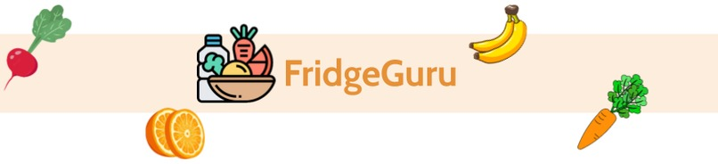
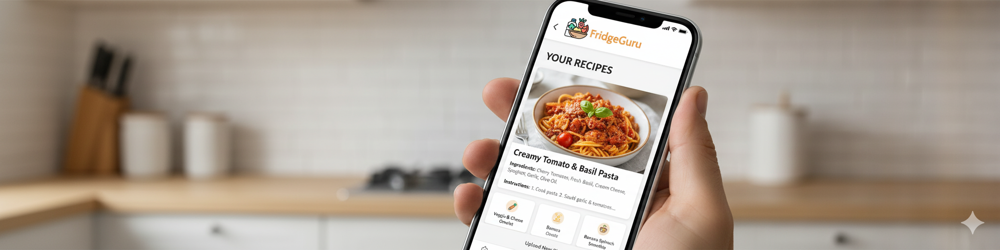
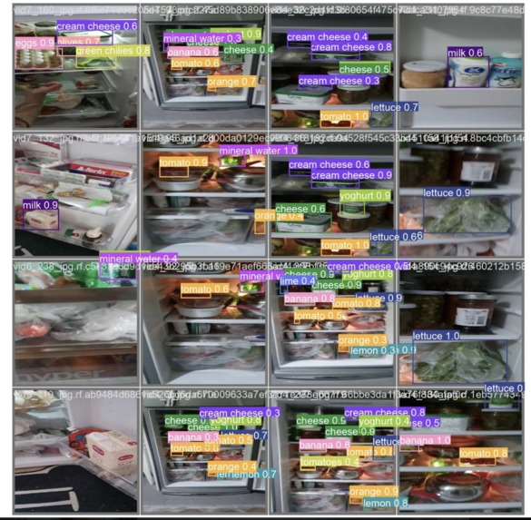

# Fridge Guru: Your Personal Recipe Assistant

The dreadful feeling you get when you open your fridge with no idea what to make is something many of us experience. This is what inspired **Fridge Guru**, an intelligent tool that captures the contents of your fridge and provides you with tailored recipe suggestions based on your specific taste and preferences. This project was built for **Hack the North 2023**, Canada's largest hackathon.

---

## ✨ What It Does

Fridge Guru provides users with three personalized food recipes based on what they have in their fridge and their unique preferences. We combine an object detection model to identify ingredients with a language model to generate creative and relevant recipes.

---

## 💻 How We Built It

### The Computer Vision Model
We built our object detection component using a **Yolov8 model** that we trained on a custom dataset. The model was developed using **Google Colab** and **TensorFlow**. The training process involved downloading the dataset from Roboflow and training a `yolov8m.pt` model for 20 epochs. The model's performance was tracked during training, with an impressive increase in mAP (mean average precision) over the epochs. The model's parameters and layers were also configured to handle our custom dataset.

### Model Training Performance

### The Web Application
The front end of the application was built using the **Taipy library**. This framework allowed us to quickly design a user interface where users can upload an image of their fridge to receive their personalized recipe suggestions.

### The Recipe Generation Model
For the recipe generation, we utilized the **EleutherAI GPT-Neo model**. This was an essential part of the project that generated tailored recipes based on the ingredients detected by our computer vision model.

---

## 🚧 Challenges and Accomplishments

Building Fridge Guru in a limited timeframe presented significant challenges, but overcoming them was a key part of our success.

### Key Challenges We Overcame:
* **Pivoting Technology:** We had to quickly pivot from our initial plan when we ran into authentication issues with OpenAI’s API. We successfully integrated the EleutherAI GPT-Neo model instead, demonstrating our adaptability.
* **New Frameworks:** Working with Taipy, a new front-end framework, was a learning curve. We navigated the documentation and solved bugs on the fly, which led to significant technical growth.
* **Time Constraints:** We had to make quick decisions and even redesign our entire web app the night before the submission to meet our goals.

### What We're Proud Of:
* **Resilience and Problem-Solving:** We fixed three major issues with our components within just three hours, proving our ability to troubleshoot under pressure.
* **Significant Learning:** We learned a great deal about new frameworks, working under pressure, and how to adapt our plans while keeping our core values and goals intact.

---

## 🚀 What's Next for Fridge Guru

The potential for Fridge Guru is endless. Some immediate features we would like to add include:

* Expanding our computer vision to other places in the kitchen, like pantries or the counter.
* Enabling users to upload multiple images live through the web app.
* Evolving our services to become a more holistic tool for users, such as ensuring their fridge is filled with great food for the whole week based on pre-planned meal plans.

---

**Devpost:** [https://devpost.com/software/fridgeguru](https://devpost.com/software/fridgeguru)

**Colab Notebook:** [https://colab.research.google.com/drive/16pojtWmodIAuI1h0PMLUDWMhYET02F-T?usp=sharing](https://colab.research.google.com/drive/16pojtWmodIAuI1h0PMLUDWMhYET02F-T?usp=sharing)